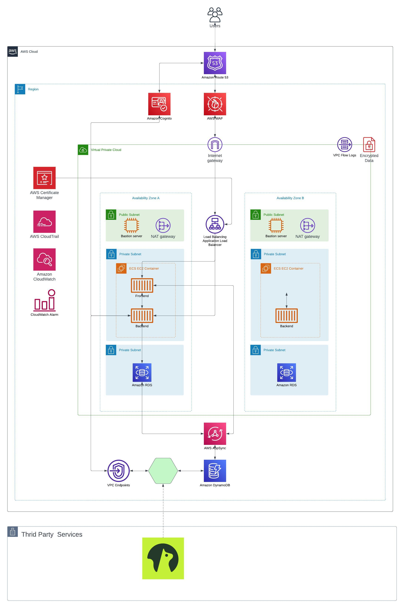

# Week 0 — Billing and Architecture

## Required Homework

   1. **Conceptual Diagram:**

         I'm sorry I couldn't find a pen and draw on a napkin.
         [Lucid Shared Link](https://lucid.app/lucidchart/caf757ed-d7ec-4e83-aee7-c3b569b8f615/edit?viewport_loc=-13%2C9%2C1579%2C833%2C0_0&invitationId=inv_2659dc32-9e1e-429d-a0e0-54c406de6f68)

         

   2. **Logical Architectual Diagram:**
         I wanted to create High Available architecture but Free Lucid has limitations, I got this limitation error while adding more details. 
         
                  
         
         That's why I could not connect the each component for the second availability zone.
         
         [Lucid Shared Link](https://lucid.app/lucidchart/8296b0fe-7dd7-48f4-9077-c5b8b75e8c3c/edit?viewport_loc=-1339%2C790%2C3790%2C2001%2C0_0&invitationId=inv_09e2f46c-56a6-49b2-a07e-badf17890c8a)
         
         

   3. **Create an Admin User:**

         
   
   4. **Generate AWS Credentials:**
   
         
   
   5. **Installed AWS CLI:**
   
   6. **Create a Billing Alarm:**
   
   7. **Create a Budget:**
##  Homework Challenges
   1. **Destroy your root account credentials, Set MFA, IAM role:**
   2. **Use EventBridge to hookup Health Dashboard to SNS and send notification when there is a service health issue:**
   3. Review all the questions of each pillars in the Well Architected Tool
   4. Create an architectural diagram (to the best of your ability) the CI/CD logical pipeline in Lucid Charts
   5. Research the technical and service limits of specific services and how they could impact the technical path for technical flexibility
   6. Open a support ticket and request a service limit
