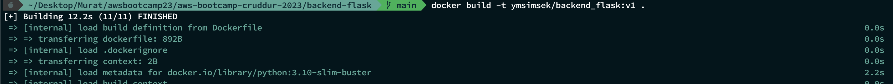
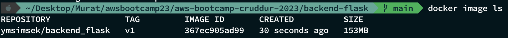
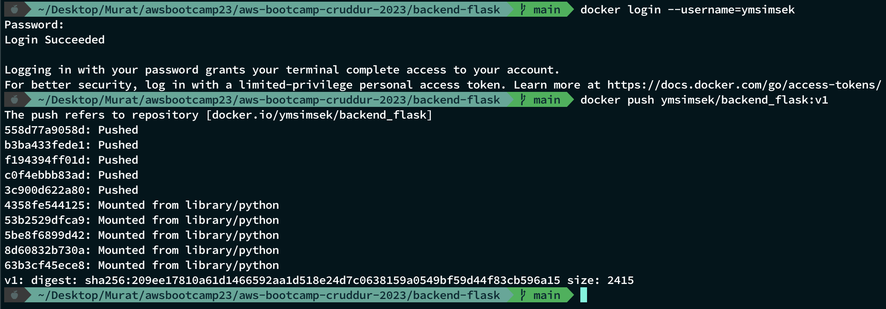
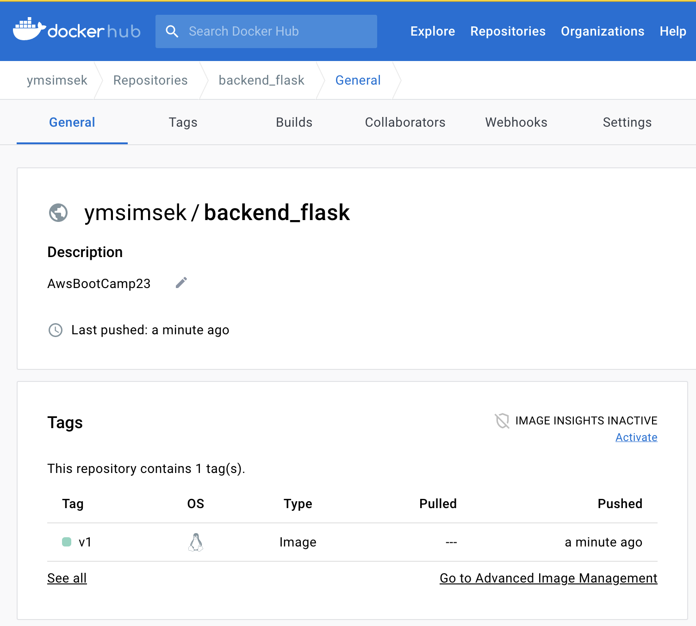
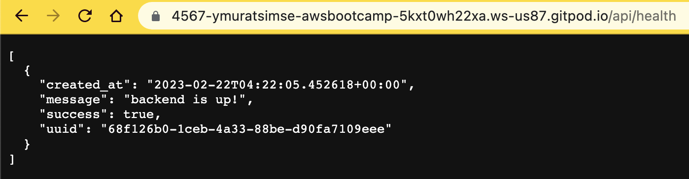
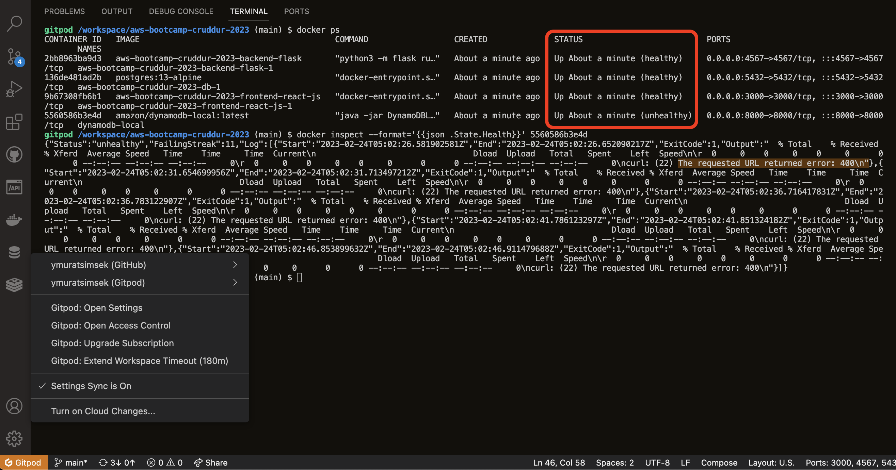
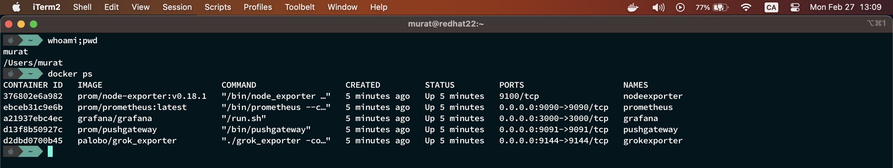
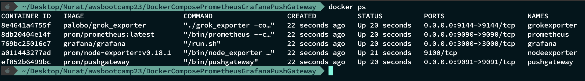
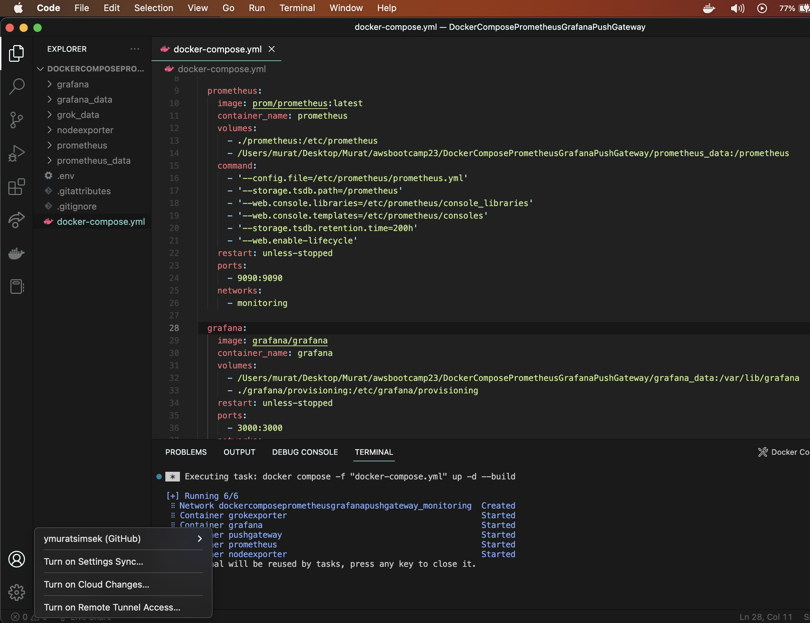
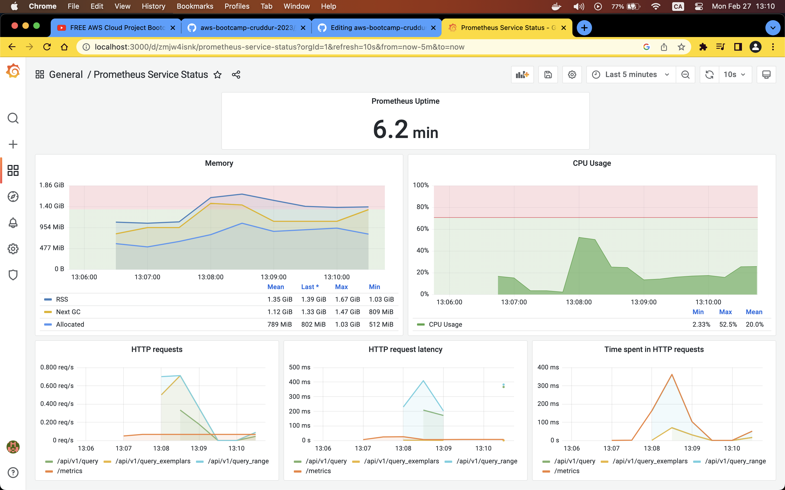

# Week 1 — App Containerization

##  Homework Challenges
   1. **Run the dockerfile CMD as an external script:**
         
         []()

         

   2. **Push and tag a image to DockerHub (they have a free tier):**
   
         - **Build with Tag:**
         
         
         - **List Images:**
         
         
         - **Push Images to Dockerhub:**
         
         
         - [Docker Hub Url](https://hub.docker.com/repository/docker/ymsimsek/backend_flask/general)
         
             
         
   3. **Use multi-stage building for a Dockerfile build:**
         
         []()

         

   4. **Implement a healthcheck in the V3 Docker compose file:**
                  
         - I have implemented the healthchecks by using docker compose file. Such as:
         
            [Docker Documentation](https://docs.docker.com/compose/compose-file/compose-file-v3/)
            ```shell
             healthcheck:
             test: ["CMD", "curl", "-f", "http://localhost:4567/api/health"]
             interval: 5s
             timeout: 10s
             retries: 3
             start_period: 40s
            ```
         - To make a `curl` request, I had to update the backed-end docker file to install the curl. 
             ```shell
             apt-get install -y curl
             ```
         - I developed a new simple healthcheck api for the backend-flask and used it with docker compose health check settings
              ```python
              @app.route("/api/health", methods=['GET'])
              ```
              

         - As seen in the screenshot, I can monitor the statuses of the backend, frontend and PostgreSQL containers.
             
              - I tried to make the health checker of Dynamodb healthy but I could not. I spent too much time thats why I did not create custom docker image for dynamodb to make a custom health check.
              
              
                 
         - How can we check if the containers are healtly?
            ```
            docker ps
            ```
         - How can we check the logs of health checker?
           ```
            docker inspect --format='{{json .State.Health}}' <container id>
            ```
         
   5. **Research best practices of Dockerfiles and attempt to implement it in your Dockerfile:**
         
         []()

         

   6. **Learn how to install Docker on your localmachine and get the same containers running outside of Gitpod / Codespaces:**
         
         - I have installed Grafana, Prometheus, Node Exporter, Grok Exporter and Push gateway for my local Observability&Monitoring.

           
           
           
         
           
         
           
   
   7. **Launch an EC2 instance that has docker installed, and pull a container to demonstrate you can run your own docker processes:**
         
         []()
   
         
