# Week 2 — Distributed Tracing

##  Homework Challenges
   1. **Instrument Honeycomb for the frontend-application to observe network latency between frontend and backend[HARD]:**
         
         I followed the [Honeycomb Doc](https://docs.honeycomb.io/getting-data-in/opentelemetry/browser-js/) to complete this task.

         - **HeatMap Durations by Url and Root Name:**         
            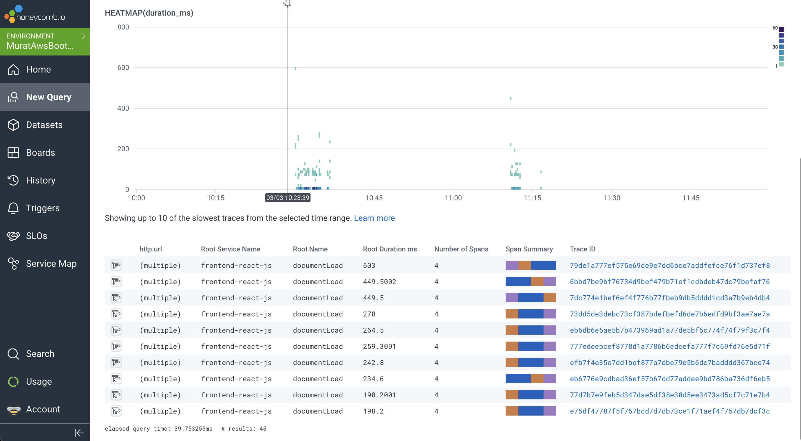

            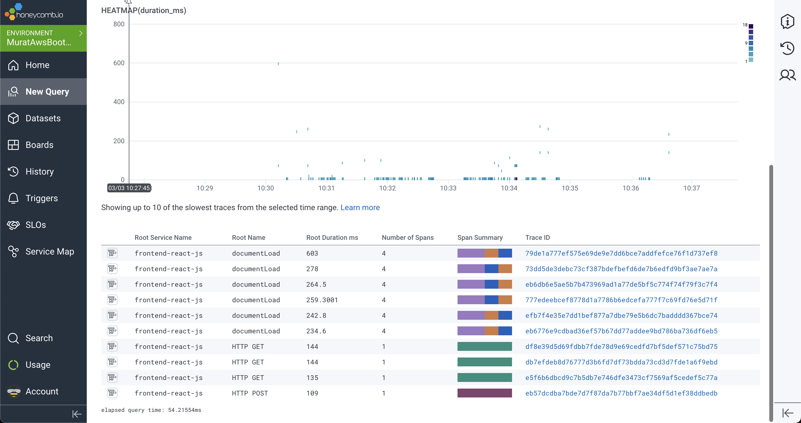         

         - **UI/Messages:**         
         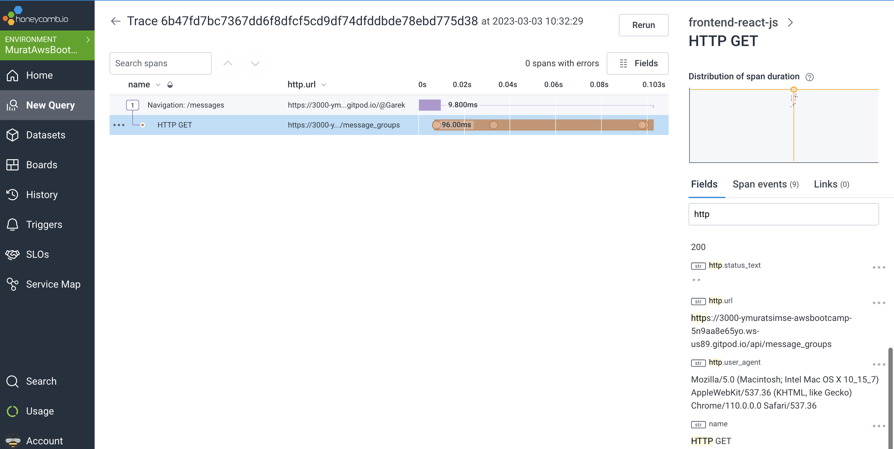

         - **UI/Notifications:**         
         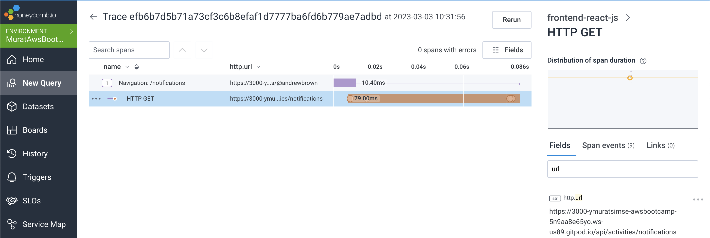

         - **API/Messages:**         
         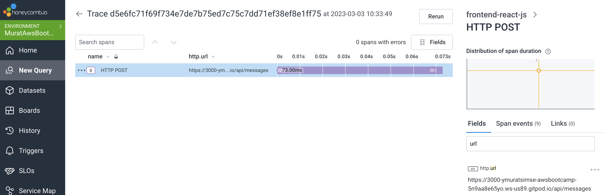

         - **API/Activities:**         
         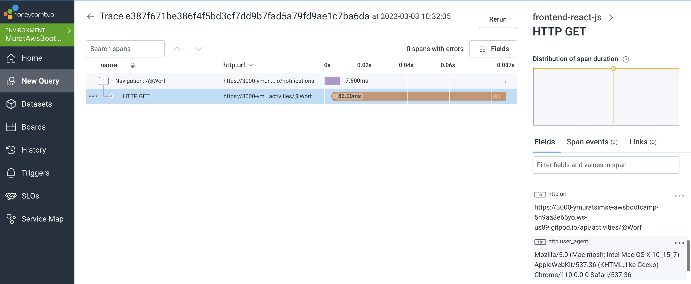

   2. **Add custom instrumentation to Honeycomb to add more attributes eg. UserId, Add a custom span:**
   
         - I have added instrumentations to all services except my custom health check api.               
         
         - I have fixed the class name of data_show_activity to test the instrumentation I added.
        
            ```python
              data = ShowActivities.run(activity_uuid=activity_uuid)
            ```
         - **Honecomb Search Graph:**
         
         
         - **CreateActivitiy Spans:**
         
         
         - **MessageGroups Spans:**
         
         
         - **Message Spans:**
           

         - **Notifications Spans:**
           
         
         - **ShowActivities Spans:**
           

         - **UserActivities Spans:**
           
         
         
   3. **Run custom queries in Honeycomb and save them later eg. Latency by UserID, Recent Traces:**

         - **Total Call Count of Frontend by Pages:**         
            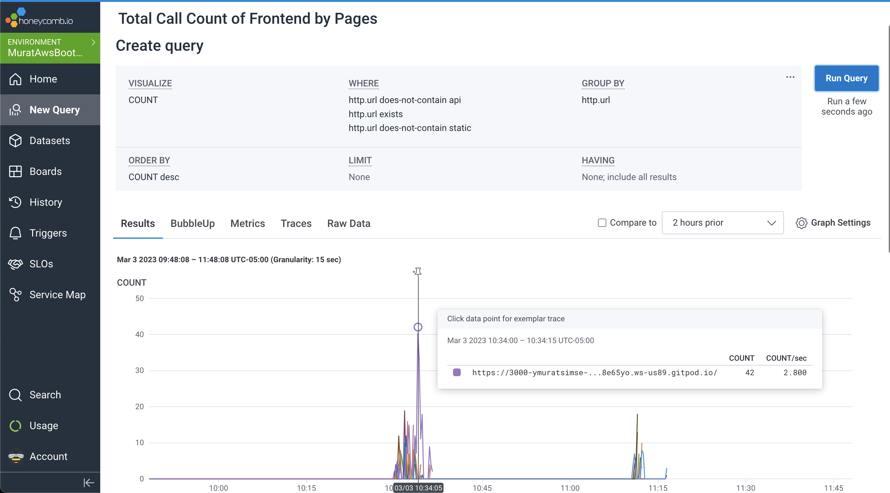

            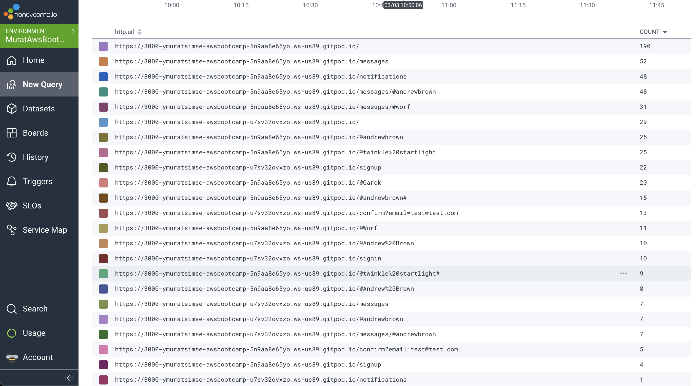
         
         - **Total Call Count of APIs by Api Url, Method and Http Status Code:**         
            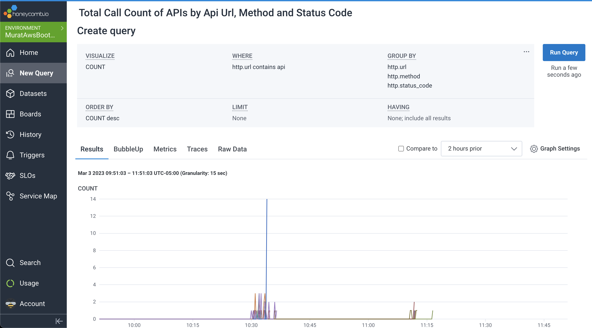

            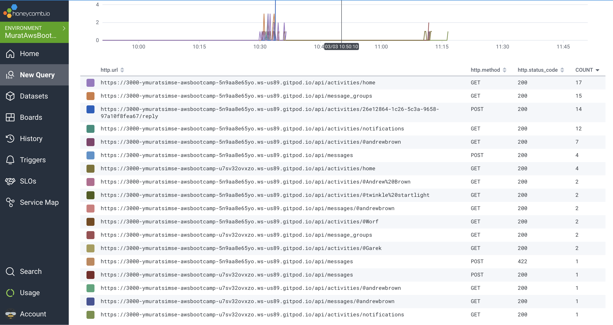
         
         - **Performance(%) of API Calls by API:**         
            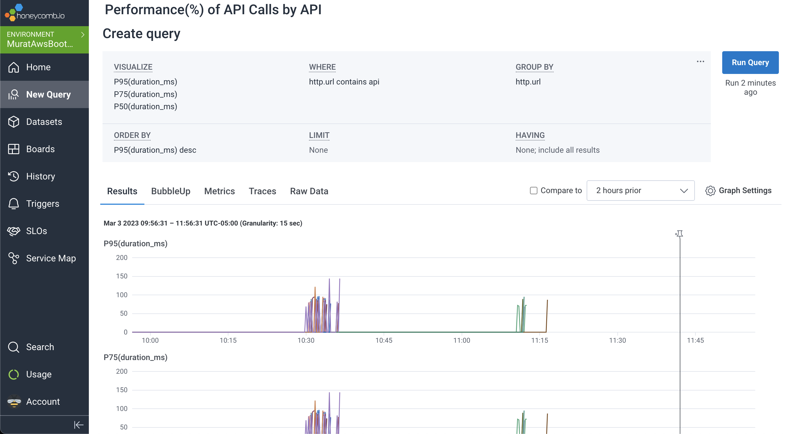

            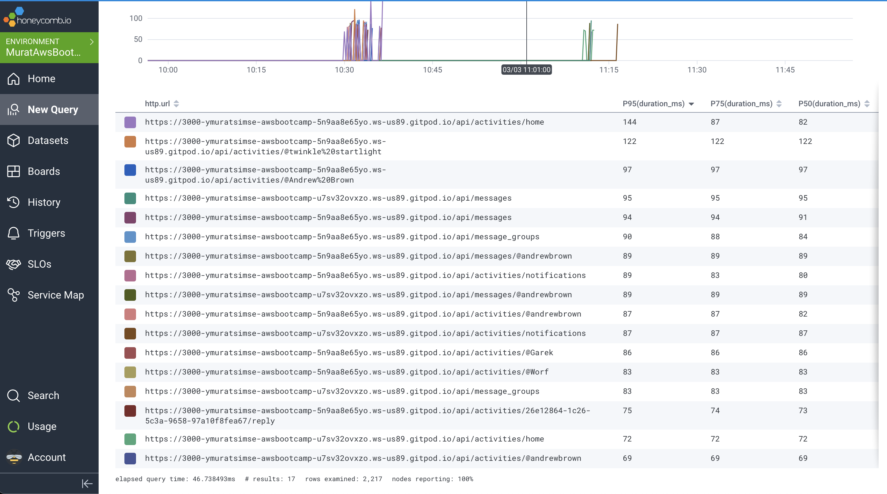
         
         - **HTTP Calls Longer Than 100ms:**         
            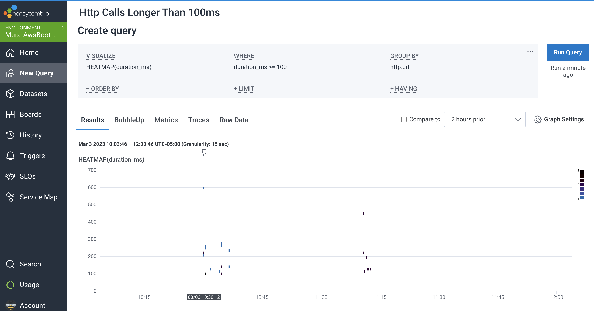

            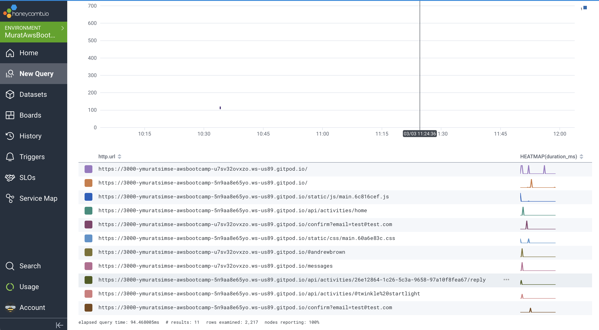
         
   4. Cloud Career Homework Details
         - When I check the 5 job descriptions, I saw that all of them have common requeirements for this job such as:
         
             1. Relevant IT infrastructure & platform knowledge
             2. Deep understanding and problem solving ability
             3. Verbal & written communication skills
             4. Analytical and problem solving skills
             5. Understanding of CI/CD and associated tools (Jenkins, etc.)
             6. Knowledge of Cloud Platform
             7. Knowledge of Infrastructure as Code (IaC)
             8. Knowledge of monitoring & alerting systems
             9. Hands on development experience with scripting languages
             
             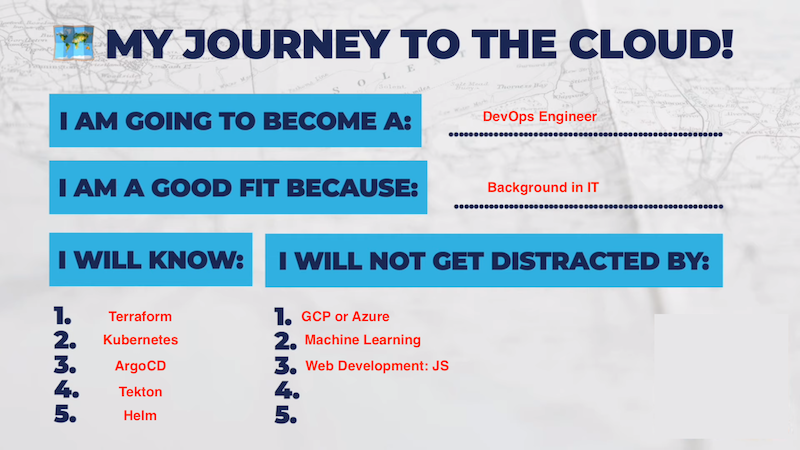


