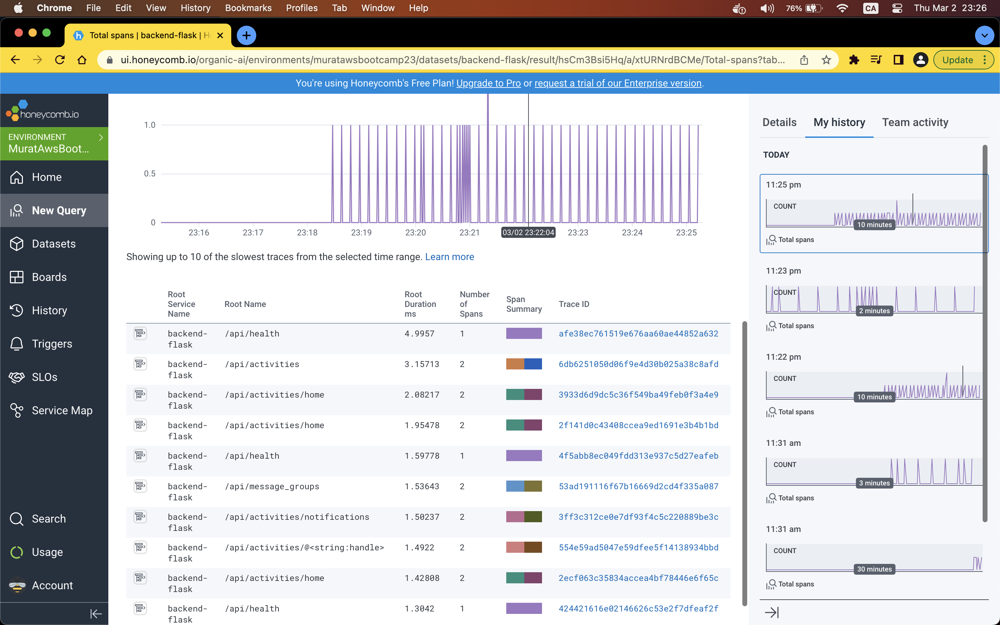
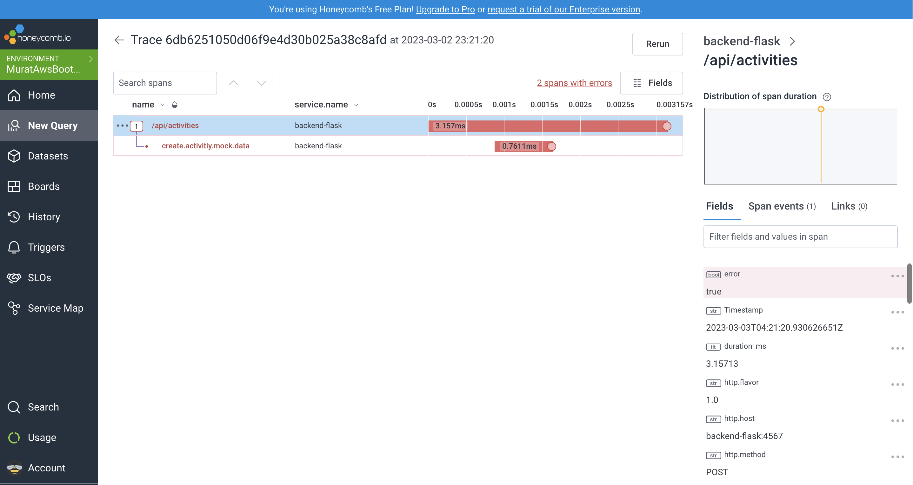
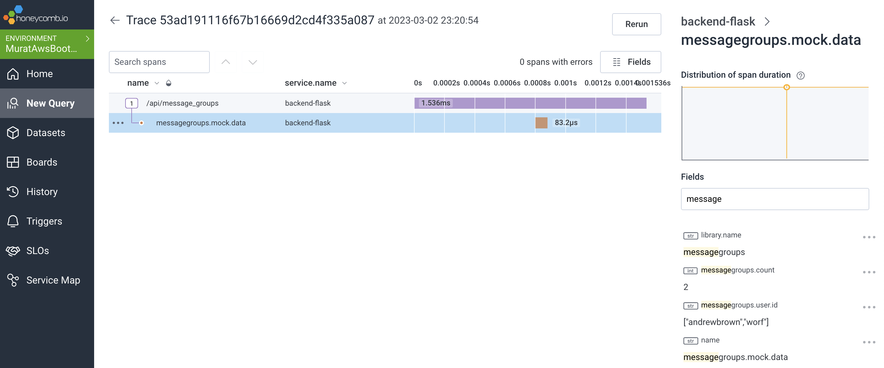
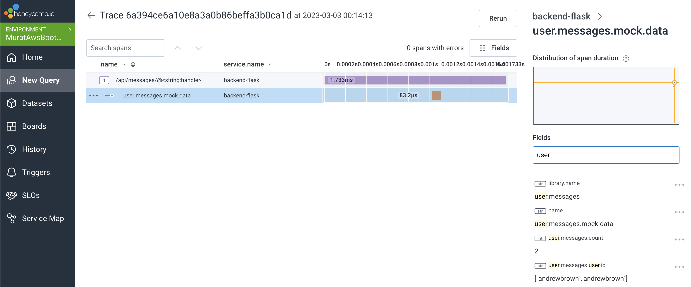
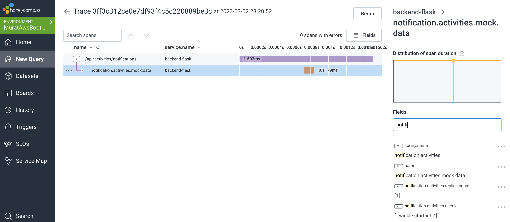
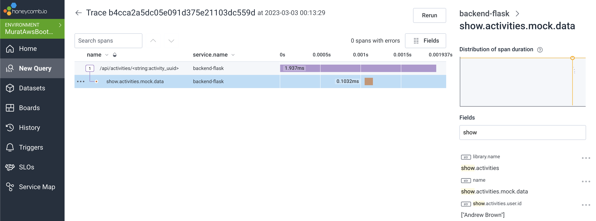
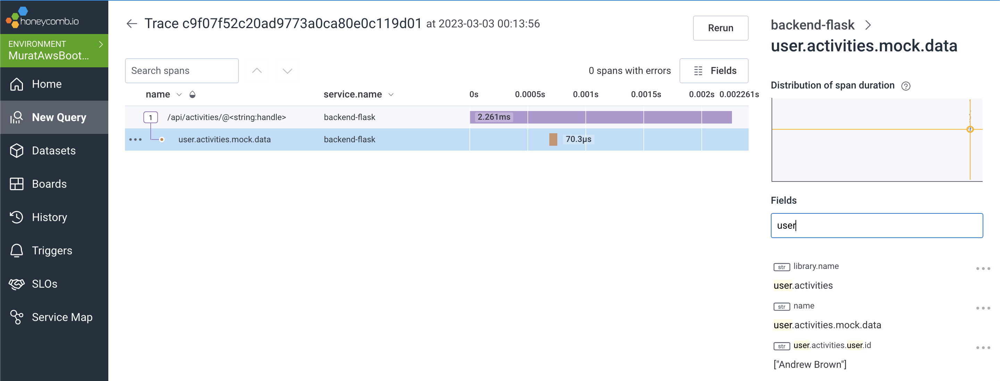

# Week 2 — Distributed Tracing

##  Homework Challenges
   1. **Instrument Honeycomb for the frontend-application to observe network latency between frontend and backend[HARD]:**
       
         

   2. **Add custom instrumentation to Honeycomb to add more attributes eg. UserId, Add a custom span:**
   
         - I have added instrumentations to all services except my custom health check api.               
         
         - I have fixed the class name of data_show_activity to test the instrumentation I added.
        
            ```python
              data = ShowActivities.run(activity_uuid=activity_uuid)
            ```
         - **Honecomb Search Graph:**
         
         
         - **CreateActivitiy Spans:**
         
         
         - **MessageGroups Spans:**
         
         
         - **Message Spans:**
           

         - **Notifications Spans:**
           
         
         - **ShowActivities Spans:**
           

         - **UserActivities Spans:**
           
         
         
   3. **Run custom queries in Honeycomb and save them later eg. Latency by UserID, Recent Traces:**


   4. Cloud Career Homework Details
Lou has released the first video from Open Up The Cloud on the cloud career topic. The details on the homework for the boot camp are available at 44:30. Completing these tasks is part of the grading rubric.
The basic homework for this section is:

Fill in the “My Journey To The Cloud” card.
Analyze 5 Job Descriptions.
The due date and details on how to submit this homework is still TBD. I will add the details here once we know more.

One of the resources mentioned in the video is the Open Up The Cloud System, which you can find at https://openupthecloud.github.io/system/
There is a lot of detailed knowledge here, so definitely check it out. The Open Up The Cloud https://github.com/openupthecloud/open-cloud-dev-box
also has a log of resources.

There is also a survey available you can https://docs.google.com/forms/d/e/1FAIpQLSeQAM4MUmPwUZraLJpPKuL8kJVM62-f8MHvauR24-C-wFdakg/viewform
If you have questions you want covered in the future sessions, you can add them here.
